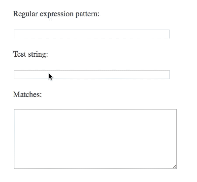

# monowasm-regex-poc

A proof of concept for using [Mono/WASM](https://github.com/mono/mono/tree/master/sdks) to play with the .NET regular expression engine from within the browser.

## Monowhatnow?

**Mono** is an open-source implementation of the .NET infrastructure.

**WASM**, or WebAssembly, a runtime to run languages other than JavaScript in the browser.

Thus, Mono/WASM lets you run C# in the browser. (And [Blazor](https://blazor.net) builds on that to have an entire C# application framework in the browser.)

## Status

This is far along enough that you can use the instructions below to get it working: type in a pattern and a test string, and you get back regex matches according to .NET:

## Goal

[regex101](https://regex101.com) lets you try regular expressions in the browser, and already supports multiple different engines (and therefore syntaxes). [Notably absent is .NET](https://github.com/firasdib/Regex101/issues/156), for lack of JavaScript re-implementation of .NET regular expression behavior.

The long-term goal of this project is to server as a proof of concept that WebAssembly can help fill this gap.

## Build and Run

The repository comes with shell scripts derived from the Mono project.

It has only been tested on macOS, but will work largely unchanged on Linux and Windows.

1. [get the Mono/WASM SDK using these instructions](https://github.com/mono/mono/blob/master/sdks/wasm/docs/getting-started/obtain-wasm-sdk.md)
2. clone this repository in a directory right underneath (such that the SDK is `..`)
3. run the three shell scripts in the filename-suggested

Then, point your browser at http://localhost:8000/sample.html, and try filling the upper two input fields.

You should see a result below, like this:

> **Regular expression pattern:**
>
>`^http(s)?://`

>**Test string:**
>
>`https://example.com`

>**Matches:**
>
>Got 1 matches:
>
>https://
